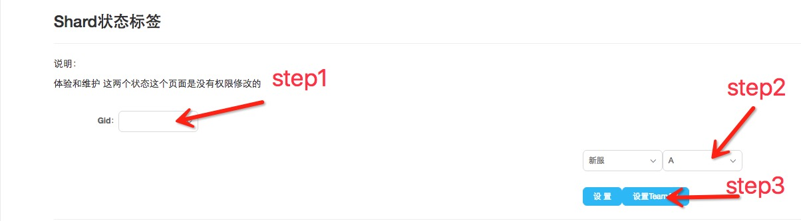
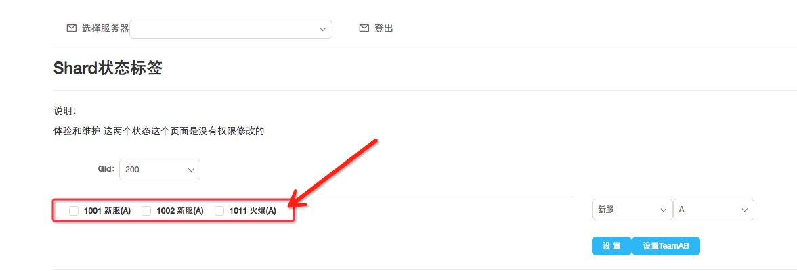

# AB TEAM Test

##AB分组测试的意义

什么是分组测试:

- 在玩家登入时,进度条有两种表现形式,所以这里将这种表现形式分为A组B组。

为何要做分组测试:

- 进度条的两种表现形式,可能会造成玩家流失,现将玩家以sid为单位将玩家分组,通过大数据
分析玩家流失问题。

##如何分组

根据需求可手动通过Gmtools将指定服调成所需的分组,共分为三组,A组,B组,AB组。没有手动通过Gmtools调节区服,默认为A组。

####A组

- 该区服所有玩家以A组表现形式表现进度条。

####B组

- 该区服所有玩家以B组表现形式表现进度条。

####AB组

- 该区服所有玩家通过玩家本身的AccoundId的最后一位字符的ASCII码值的奇偶性来分组,将奇数分到A组,
将偶数分到B组。

##如何实现分组

####ETCD

- etcd新建key值 Team
- value 有三种(A,B,AB)

####Auth服务器

- 玩家登入时获取etcd配置中的 Team 配置,根据配置将本区服分组。
- 登入成功后将分组信息传给前端
- ps:配置为空时默认为A组表现形式

####Gmtools

- Gmtools 主要来改写区服etcd中Team的配置。

####客户端

- 根据服务器返回的该玩家的分组信息表现应有的进度条形式。

##如何使用Gmtools将区服分组

* 1.登入Gmtools工具网页,选择shard状态标签功能
* 2.如图示,选择Gid,选择分组,点击设置TeamAB按钮

* 3.设置成功后可以查看当前分组信息,如图下图所示。

