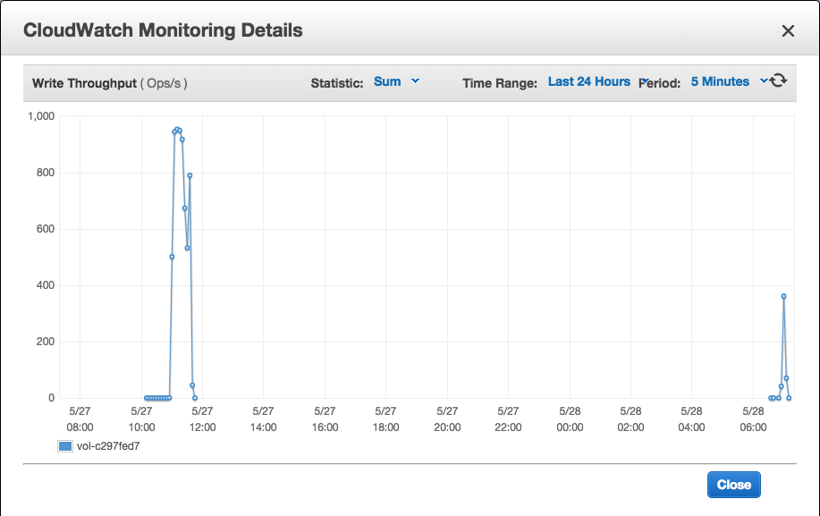
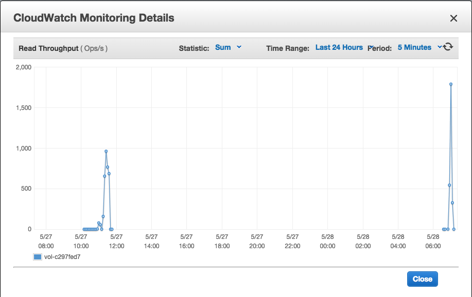

# Redis落地测试结果

分两种测试：

- Redis -> S3
- Redis -> DynamoDB

## 测试数据

使用脚本模拟了25w个账户，每个账户的大小为70KB，分为两个Key存储。
所有数据在一个Redis实例中，已使用内存为22.97GB

使用了一个Redis实例：
类型:cache.m3.2xlarge 大小 27.9GB

落地服务器：
类型:m3.2xlarge 

- vCPUs:8
- Memory:30
- Storage:2 x 80 (SSD)
- Network:High

## S3 

测试结果：

- 15个Work协程 32分钟 无写入错误 
- 128个Work协程 18分钟 但有写入错误
- 64个Work协程 15分钟 无写入错误 

注 第三次测试时修改了程序，不产出大量日志，增加了写入错误重试机制.


## DynamoDB

开启写入容量为上限10000

- 8个Work协程 30分钟

## SSDB

环境：

SSDB 
m3.2xlarge 200GB硬盘 IOPS 600-3000

测试结果：

- 10个Work协程 每次读取100个key 11分钟
- 第二次测试是20分钟

因为新建盘时会有预设的IOPS，所以那次测试很快，第二次测试时只有恢复的IOPS，整个落地过程中出现了IOPS不足的情况，所以时间会加长。

读写记录（左侧的）

**Write**



**Read**



## 结果分析

由于背包单条Key的大小为69KB，对于DynamoDB来说是很大的数据量，对于ThroughPut IO的计算是每1KB是一个unit. 所以导致在大量写入时，DynamoDB会因为达到10000 IO ThroughPut后出现，拦截写入请求，从而触发重试机制，这会导致Work消耗大量时间等待重试，导致整体效率不高。

对于S3的话，Work协程太多会导致底层出现http请求超时，同样会触发重试，所以协程不能开太多。

使用DynamoDB时需要注意容量动态扩充逻辑和重试机制，全落地需要保证所有账号都存储正确，重试等待时间上限要不通常长一些。 

DynamoDB IO Throughput 其他注意事项:
 
 - 增长只能每次翻倍设置，并且需要等待很久。
 - 递减只能每天调整4次 

不论是从消耗还是效率来看，S3要比DynamoDB更适合落地。

## Redis内存占用
ziplist 编码方式没有启用的问题见这里：
见 http://redisbook.com/preview/object/hash.html

启用条件：
哈希对象保存的所有键值对的键和值的字符串长度都小于 64 字节；
哈希对象保存的键值对数量小于 512 个；

我们的存档不符合，所以都是hashtable，
可以考虑修改配置，强制以ziplist存储，但需要验证ziplist是否适合我们的库。


## Redis内存容量与数据量的差异
数据量（16GB左右）是指存入S3的json串的大小，而非内存中的占用量，
对于数据，内存中通过debug object得出的serializedlength值是指存入硬盘后的容量，
我们的数据大多是字符串，且小于1MB，Redis会预分配一倍的内存量，对一份bag数据来说：

```
debug object bag:0:0:1
Value at:0x7fee0bc4f9b0 refcount:1 encoding:hashtable serializedlength:55893 lru:4295945 lru_seconds_idle:13
```

serializedlength值w为54.5kb，内存占用约为 54.5kb * 2 = 109kb，
bag在s3中的为69.3kb.

内存 / s3容量 为 1.57, 
实验结果中Raw数据应该是16GB，Redis占用内存22.97，两者比例为 1.43，
结果基本一致。

## Redis备份
AWS的Redis备份时间受到可用内存影响：

实例一 5.4G/6G 全备份用时34分钟
实例二 5.4G/13.3G 全备份用时22分钟


