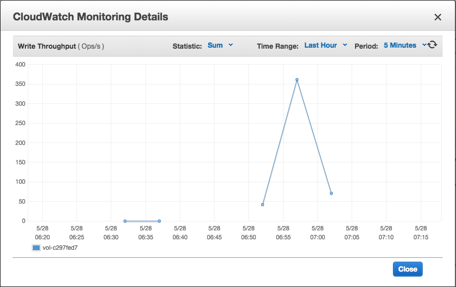

# Redis回档测试结果

分两种测试：

- S3 -> Redis
- DynamoDB -> Redis

## 测试数据

使用脚本模拟了25w个账户，每个账户的大小为70KB，分为两个Key存储。
所有数据在一个Redis实例中，已使用内存为22.97GB

使用了一个Redis实例：
类型:cache.m3.2xlarge 大小 27.9GB

落地服务器：
类型:m3.2xlarge 

- vCPUs:8
- Memory:30
- Storage:2 x 80 (SSD)
- Network:High

## S3 

测试结果：
- 每次取250个数据 10个Work协程 21分钟

## DynamoDB

开启读取容量为上限8000

- 每次取250个数据，10个Work协程 46分钟
- 每次取1000个数据，100个Work协程 42分钟

测试发现利用的容量仅为700-1000左右， 基本稳定在800

并发Scan

开启读取容量为3000

- 每次读取100个数据，10个并发Scan协程，10个Work协程 6分钟

注意DynamoDB每个返回大小限制为1MB，当超出限制时，数据会不会追加进包里，这样不会引起错误。

## SSDB

环境：

SSDB 
m3.2xlarge 200GB硬盘 IOPS 600-3000

测试结果：

- 10个Work协程 每次读取100个key 80分钟

第二次测试（等待IOPS恢复以后）

- 20个Work协程 每次读取1024个key 7分钟

上次测试之所以慢，一方面SDK确实有BUG，另一方面之前的落地测试消耗光了IOPS。

读写记录（左侧的）

**Write**

**Read**

## 结果分析

DynamoDB的Scan吞吐量上不去，所以要比S3回档慢很多。

DynamoDB并发Scan效果很好，根据监控显示如果读取流量大的话，时间会更短。

不论是从消耗还是效率来看，S3要比DynamoDB更适合回档？

